## [Level 1: Hello, world of XSS](https://xss-game.appspot.com/level1)

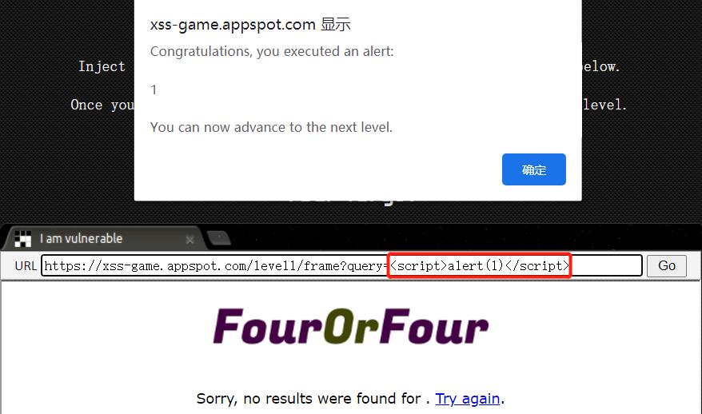

## [Level 2: Persistence is key](https://xss-game.appspot.com/level2)

- 从第一篇博客可以看出来，HTML 标签是可用的，但`<script>alert(1)</script>`在本关不起作用<br>
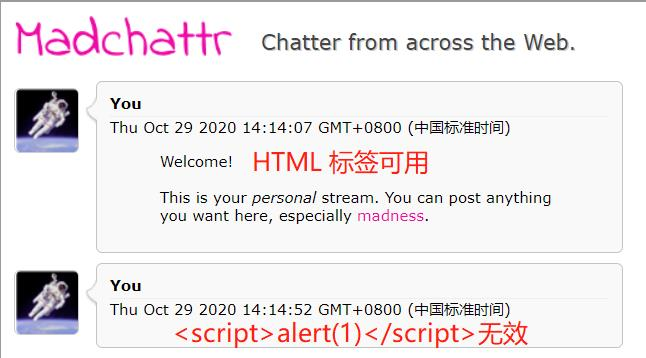
- 利用标签事件属性，``<br>
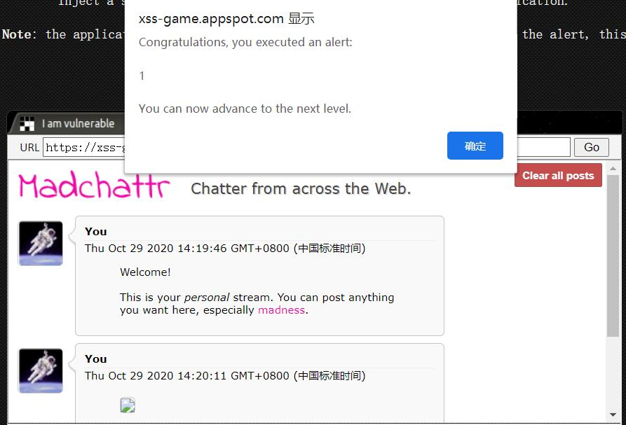

## [Level 3: That sinking feeling...](https://xss-game.appspot.com/level3)

- 访问包含指定图片的链接由基础链接`https://xss-game.appspot.com/level3/frame#`和图片序号组成。输入序号`<hi>hi`进行测试，发现该『序号』直接拼接到了``标签的`src`属性中<br>
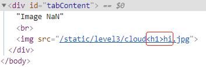
- 不过需要注意只有单引号才可以截断，查看 JS 代码可知<br>
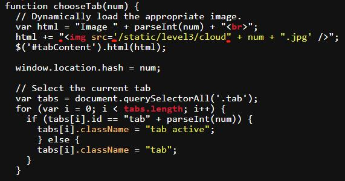
- 单引号截断，插入`onerror`属性，完成弹框<br>
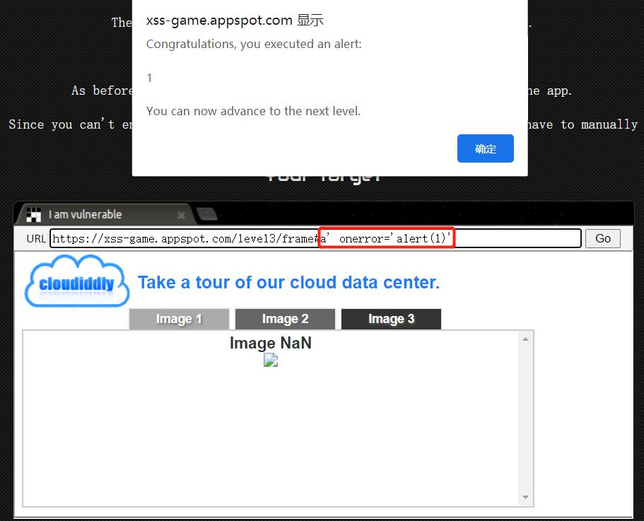

## [Level 4: Context matters](https://xss-game.appspot.com/level4)

- 提交一个整数，会启动一个计时器并在整数（提交的整数）秒后弹框，提示『计时结束』
- 查看源码，注意到
  ```html
  
  ```
- 提交一个单引号`'`，控制台会报错，意味着逃逸的可能性<br>
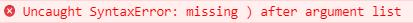
- 事件属性中可以添加多个函数，在`onload`事件属性中再塞一个`alert`函数就可以了咕！<br>
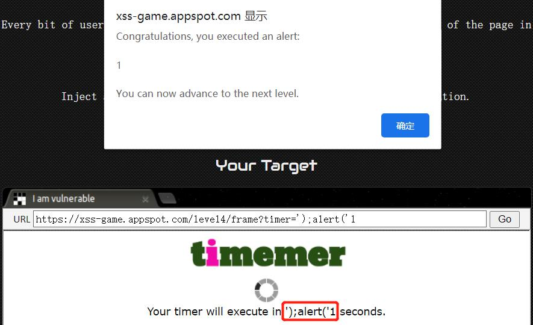

## [Level 5: Breaking protocol](https://xss-game.appspot.com/level5)

- 共三个界面：主界面、注册界面和注册完成提示跳转的界面
- 注册界面的 URL 包含参数`next`，同时注册界面的`Next >>`按钮的`href`属性的值由该参数决定
  ```py
  # part of level.py
  if "signup" in self.request.path:
        self.render_template('signup.html',
          {'next': self.request.get('next')})

  # part of signup.html
  <a href="{{ next }}">Next >></a>
  ```
- `href`属性可以链接 JS。访问 https://xss-game.appspot.com/level5/frame/signup?next=javascript:alert(1)，并点击`Next >>`可弹框<br>
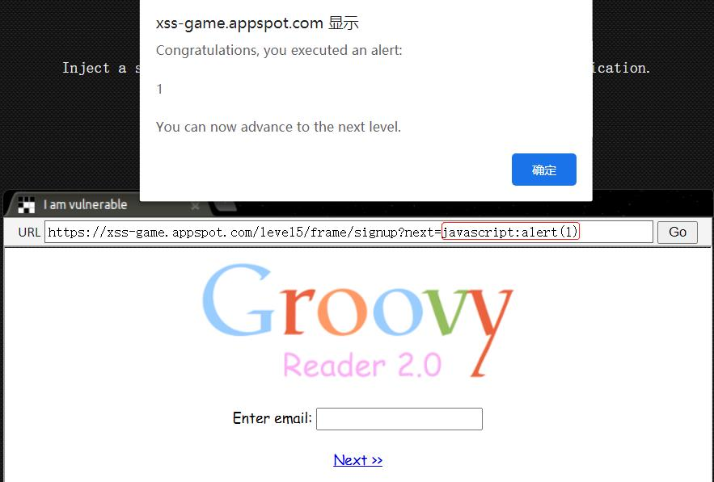

## [Level 6: Follow the 🐇](https://xss-game.appspot.com/level6)

- 访问文件的文件名是通过访问 URL 中 *#* 后的字符串决定，截取字符串后传递给`includeGadget`函数做后续处理
  ```html
  // Take the value after # and use it as the gadget filename.
  function getGadgetName() {
    return window.location.hash.substr(1) || "/static/gadget.js";
  }

  includeGadget(getGadgetName());

  function includeGadget(url) {
    // 创建一个 script 标签
    var scriptEl = document.createElement('script');

    // This will totally prevent us from loading evil URLs!
    // 只匹配小写，大写即可绕过
    if (url.match(/^https?:\/\//)) {
      setInnerText(document.getElementById("log"),
        "Sorry, cannot load a URL containing \"http\".");
      return;
    }

    // Load this awesome gadget
    scriptEl.src = url;

    // Show log messages
    scriptEl.onload = function() {
      setInnerText(document.getElementById("log"),
        "Loaded gadget from " + url);
    }
    scriptEl.onerror = function() {
      setInnerText(document.getElementById("log"),
        "Couldn't load gadget from " + url);
    }
    // 插入到 head 中
    document.head.appendChild(scriptEl);
  }
  ```
- `<script>`标签的`src`属性的值可以是指向 JS 文件的 URL，绝对路径或相对路径，或使用 Data URLs 【更方便】
- 通过指向 JS 文件的 URL 触发，使用咕果的 JSAPI<br>
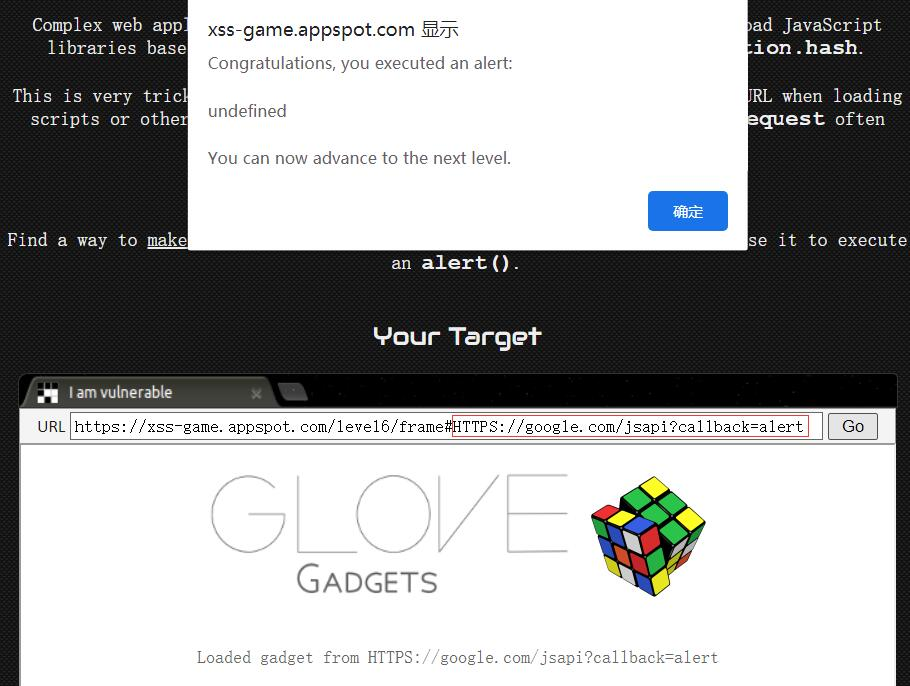
- 通过 Data URLs 触发， MIME type 的值不影响<br>
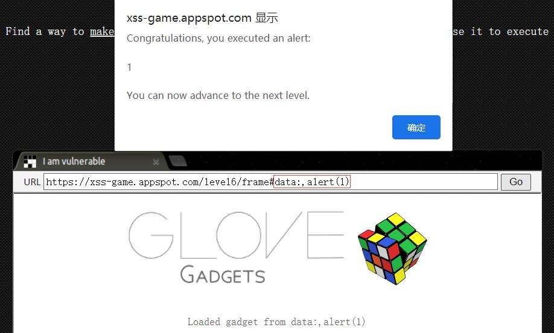

### 参考资料

[Data URLs - HTTP | MDN](https://developer.mozilla.org/en-US/docs/Web/HTTP/Basics_of_HTTP/Data_URIs)